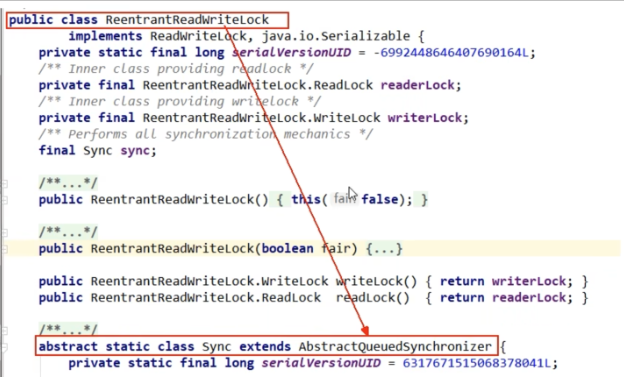
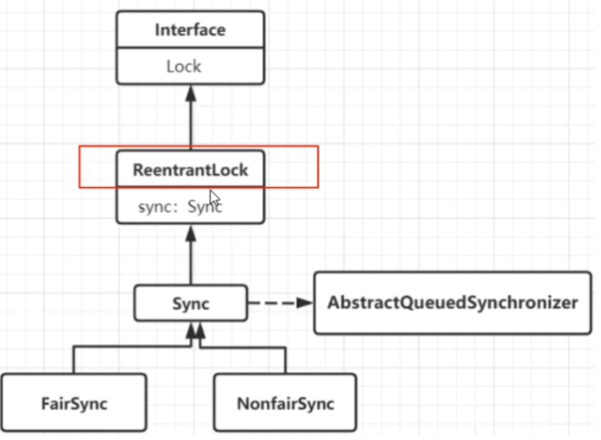
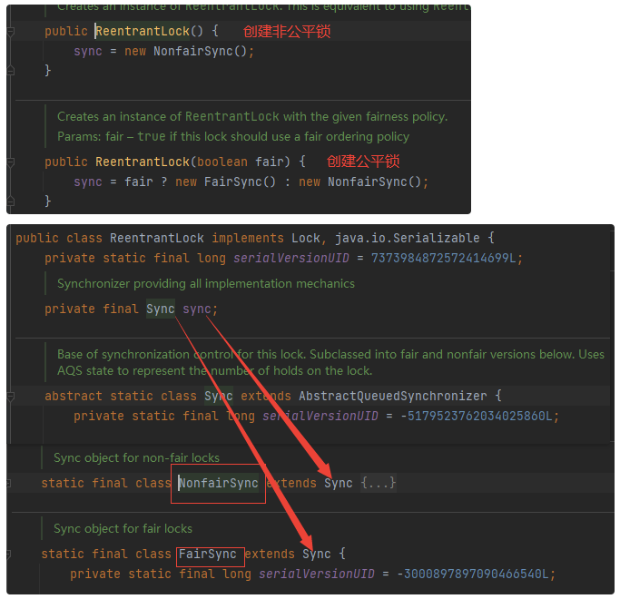
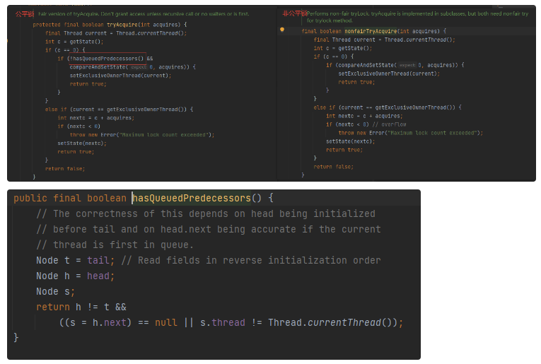
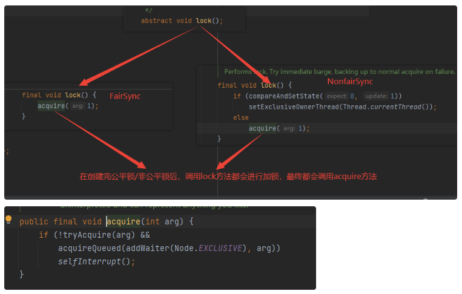
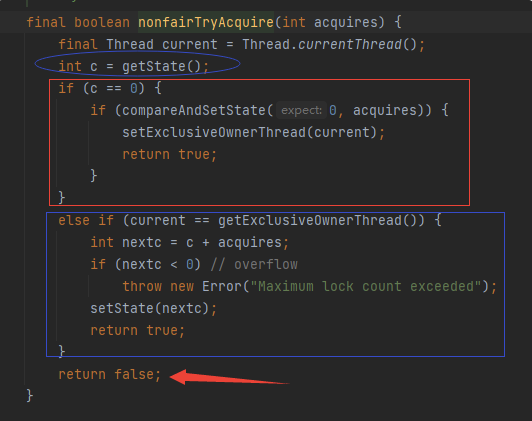
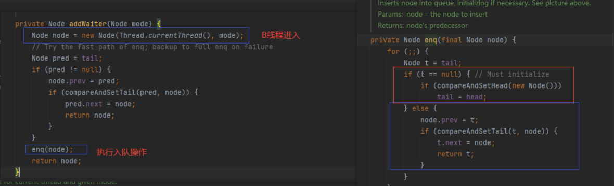
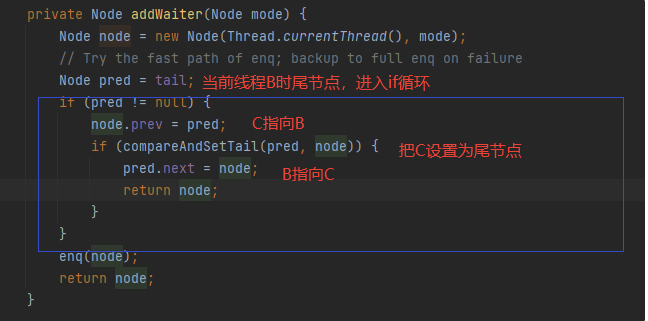
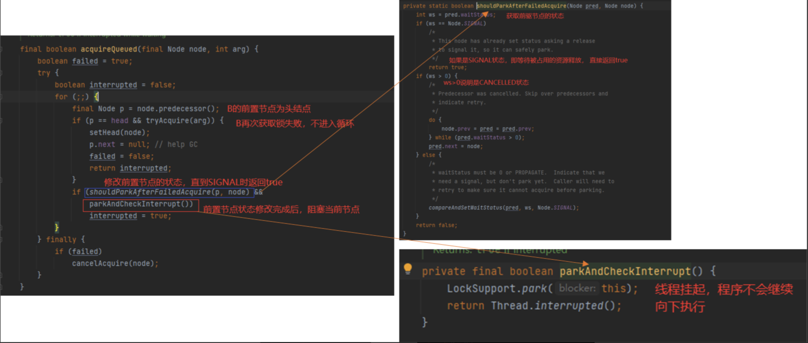
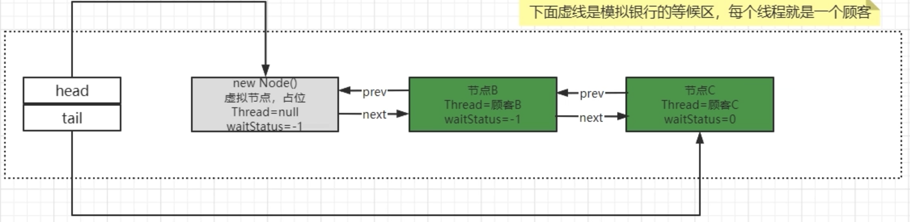

# AbstractQueuedSynchronizer之AQS

## AQS入門級別理論知識

### 是什麼

抽象的對列同步器

#### 技術解釋

是用來實現鎖或者其他同步器組建的公共基礎部分的抽象實現，是**重量級基礎框架及整個JUC體系的基石，主要用於解決"鎖分配給誰"的問題**。

整體就是一個抽象的FIFO**對列**來完成資源獲取線程的排隊工作，並通過**一個`int`類變量**表示持有鎖的狀態。

CLH：是一個單向鏈表，AQS中的對列是CLH變體的**虛擬雙向對列FIFO**。

### AQS為什麼是JUC內容中最重要的基石

#### 和AQS有關的

##### `ReentrantLock`

##### `CountDownLatch`

##### `ReentrantReadWriteLock`

##### `Semaphore`

#### 進一步理解鎖和同步器的關係

* 鎖，面向鎖的使用者：定義了程序員和鎖交互的使用層API，隱藏了實際細節，我們調用即可。
* 同步器，面向鎖的實現者：DougLee提出統一規範並簡化鎖的實現，**將其抽象出來**屏蔽了同步狀態管理、同步對列的管理和維護、阻塞線程排隊和通知、喚醒機制等，是一切鎖和同步組建實現的---**公共基礎部分**。

### 能幹嘛

**加鎖會導致阻塞**：有阻塞就需要排隊，實現排隊必然需要對列。

* 搶佔到資源的線程直接使用處理業務，搶不到資源的必然涉及一種**排隊等候機制**。搶佔資源失敗的線程既須去等待(類似銀行業務辦理窗口都滿了，暫時沒有受理窗口的顧客只能去**候客區排隊等候**)，但等候線程仍然保留獲取鎖的可能且獲取鎖流程仍在繼續(候客區的顧客也在等著叫號，輪到了再去受理窗口辦理業務)。
* 如果共享資源被佔用，**就需要一定的阻塞等待喚醒機制來保證鎖分配**。這個機制主要用的是CLH對列的變體實現的，將暫時獲取不到鎖的線程加入到對列中，這個對列就是AQS同步對列的抽象表現。他將要請求共享資源的線程及自身的等待狀態封裝成對列的節點對象(`Node`)，通過CAS、自旋以及`LockSupport.park()`的方式維護`state`變量的狀態，使并發打同步效果。

### 小總結

## AQS源碼分析前置知識

### AQS內部體系架構圖

### AQS內部體系架構 - AQS本身

#### AQS的`int`變量

AQS的同步狀態`state`成員變量，類似銀行辦理業務的受理狀態

* 0就是沒人，自由狀態可以辦理
* 大於等於1，有人佔用窗口，需要等待

#### AQS的CLH對列

一個雙向對列，類似銀行候客區的等待顧客

#### 小總結

* **有阻塞就需要排隊，實現排隊必然需要隊列**。
* `state`變量 + CLH雙端隊列。

### AQS內部體系架構 - 內部類Node

#### Node的`int`變量

`waitStatus`成員變量，類似等候區其他顧客(其他線程)的等待狀態(隊列中每個排隊的個體就是一個`Node`)。

#### Node此類的講解

## AQS源碼分析

`Lock`接口的實現類，基本都是通過了**聚合了一個隊列同步器的子類**完成線程訪問控制的。

### `ReentrantLock`

#### 從`lock()`方法看公平鎖、非公平鎖

💡**公平鎖和非公平鎖的`lock()`方法唯一的區別在於公平鎖在獲取同步狀態時多了一個限制條件：`hasQueuedPredecessors()`，該方法是公平鎖加鎖時判斷等待隊列中是否存在有效節點的方法**。

#### 以非公平鎖`ReentrantLock()`為例，看`lock()`方法

對比公平鎖和非公平鎖的`tryAcquire()`方法的實現代碼，其實差別就在於非公平鎖獲取鎖時比公平鎖少了一個判斷`!hasQueuedPredecessors()`，`hasQueuedPredecessors()`中判斷了是否需要排隊，導致公平鎖和非公平鎖的差異如下：

* 公平鎖：公平鎖講究先來先到，線程在獲取鎖時，如果這個鎖的等待隊列中已經有線程在等待，那麼當前線程就會進入等待隊列中。
* 非公平鎖：不管是否有等待隊列，如果可以獲取鎖，則立刻佔有鎖對象。也就是說隊列的第一個排隊線程甦醒後，不一定就是排頭的這個線程獲取鎖，他還是需要參加競爭鎖(存在線程競爭的情況下)，後來的線程可能插隊奪取鎖。

在創建完公平鎖/非公平鎖後，調用`lock()`方法會進行加鎖，最終都會調用到`acquire`方法。

##### `acquire()`

##### `tryAcquire(arg)`

* 返回`false`：繼續推進條件，走下一個`acquireQueued(addWaiter(Node.EXCLUSIVE), args)`方法。
* 返回`true`：結束

##### `addWaiter(Node.EXCLUSIVE)`，參加排隊

⚠️在雙向鏈表中，第一個節點為**虛擬節點(也叫哨兵節點)**，其實不存儲任何信息，只是佔位。**真正的第一個有數據的節點是第二個節點開始的**。

假如此時有線程C進入：

##### `acquireQueued(addWaiter(Node.EXCLUSIVE), args)`，坐穩隊列

##### 示意圖

