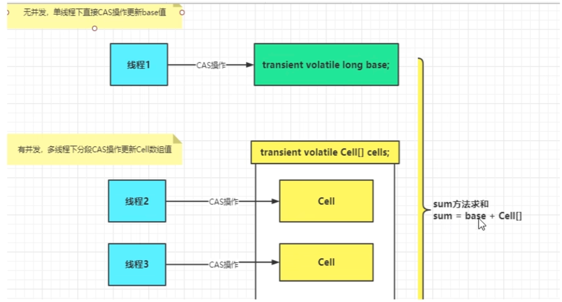
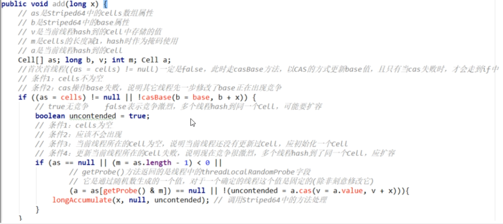
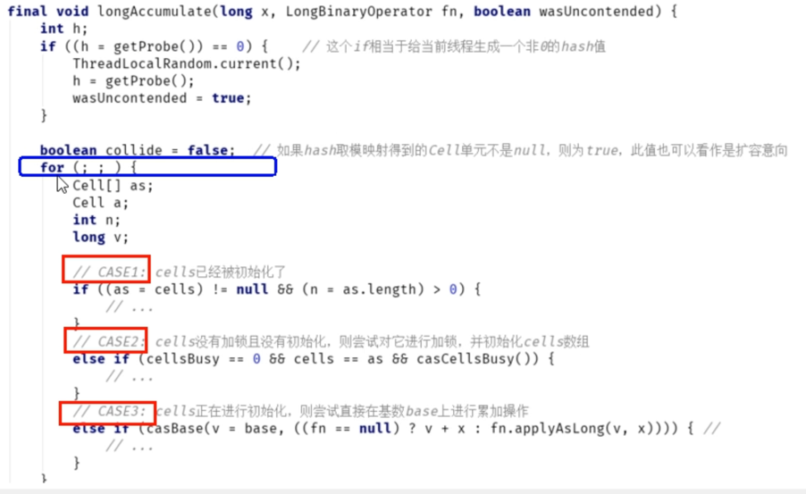
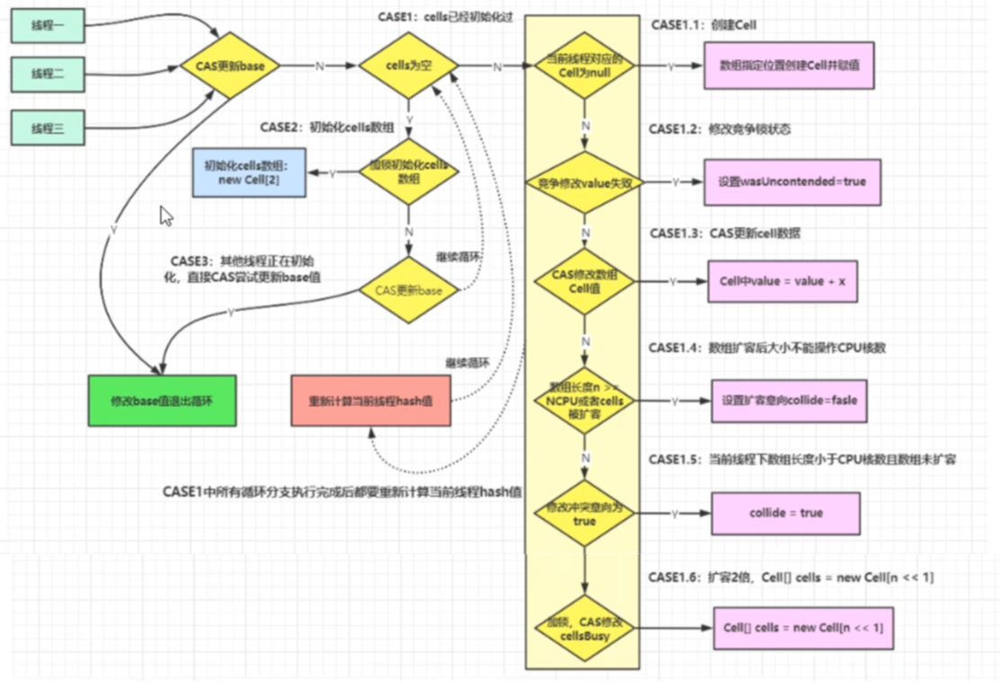
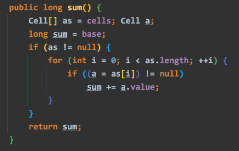

# 原理分析

## LongAdder爲什麼這麼快？
* LongAdder的基本思路就是**分散熱點**，將value值分散到一個**Cell數組**中，不同線程會命中到數組的不同槽中，各個線程只對自己槽中的那個值進行CAS操作，這樣熱點就被分散了，衝突的概率就會小很多。 
    如果要獲取真正的long值，只要將各個曹中的變量值累加返回。
* `sum()`會將所有Cell數組中的value和base累加作為返回值，核心的思路就是將之前AtomicLong的value的壓力分散到多個value中去，**從而降級更新熱點**。
* 內部有一個base變量，一個Cell[]數組
  
  * base變量：低並發，直接累加到該變量上
  * Cell[]數組：高並發，累加到各個線程自己的槽Cell[i]中

## 源碼分析
LongAdder在無競爭的情況下，和AtomicLong一樣，對同一個base進行操作，當出現競爭關係時則是採用**化整為零分散熱點的做法**，用空間換時間，用一個數組cells，將一個value拆分進這個cells數組。 
多個線程需要同時對value進行操作時，可以對線程id進行hash得到hash值，再根據hash值映射到這個cells數組的某個下標，再對該下標所對應的值進行自增操作。 
當所有線程操作完畢，將數組cells的所有值和base加起來作為最終結果。

### `add()`

1. 如果Cells表為空，嘗試用CAS更新base字段，成功則退出
2. 如果Cells表為空，CAS更新base字段失敗，出現競爭，`uncontended`為true，調用`longAccumulate()`(新建數組)
3. 如果Cells表非空，但當前線程映射的槽為空，`uncontended`為true，調用`longAccumulate()`(初始化)
4. 如果Cells表非空，且當前線程映射的槽非空，CAS更新Cell的值，成功則返回，否則`uncontended`設為false，調用`longAccumulate()`(擴容)

### `longAccumulate()`

先給當前分配一個hash值，然後進入一個`for`自旋，這個自旋分為3個分支
* CASE1: Cell[]數組已經初始化
* CASE2: Cell[]數組尚未初始化(首次新建)
* CASE3: Cell[]數組正在初始化中

### `sum()`

* 為什麼在并發環境下sum值會不精確？
    * sum執行時，並沒有限制對base和cells的更新，所以LongAdder不是強一致性的，他是最終一致性的

## 總結
* `AtomicLong`
  * 線程安全，可以允許一些性能消耗，要求高精度時可以使用
  * 保證精度，性能代價
  * AtomicLong是多線程針對單個熱點值value進行原子操作
* `LongAdder`
  * 當需要在高并發下有較好的性能表現，且對精確度要求不高時，可以使用
  * 保證性能，精度代價
  * LongAdder是每個線程擁有自己的槽，各個線程一般只對自己槽中的那個值進行CAS操作