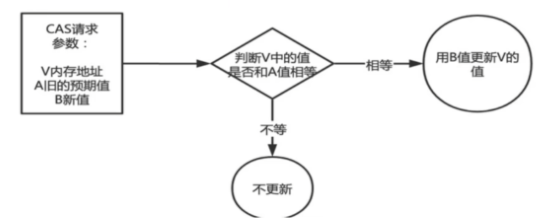

# CAS

compare and swap的縮寫，翻譯成**比較並交換**，實現並發算法時常用到的一種技術。 
它包含3個操作數：內存位置的值、預期值及更新值。 

執行CAS操作時，將內存位置的值與預期值比較：
* 如果**相匹配**，那麼處理器會自動將該位置值更新為新值。
* 如果**不匹配**，處理器不做任何操作，多個線程同時執行CAS操作只有一個會成功。

CAS有3個操作數，內存位置值V、舊的預期值A和要修改的更新值B。 
當舊的預期值A和內存值V相同時，將內存值V修改為B，否則什麼都不做或重來。 
當他重來重試的這種行為稱為 - **自旋**

