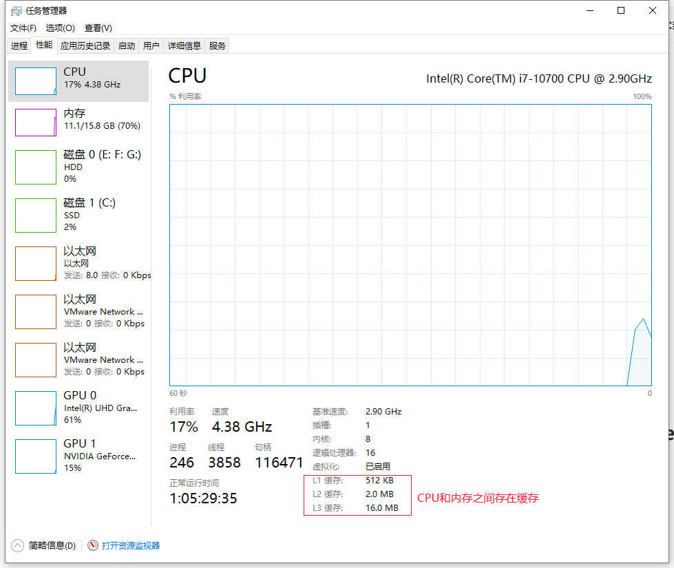
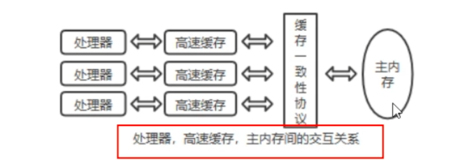
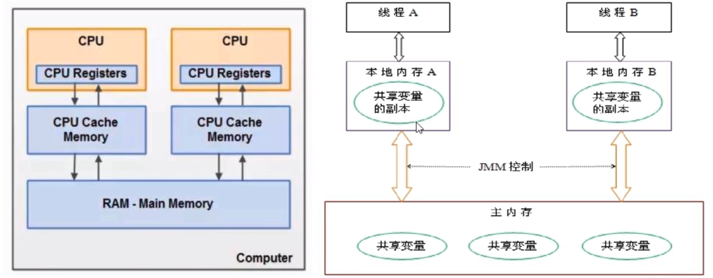
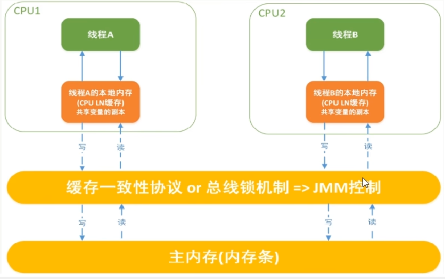

# JMM

## 電腦硬體存儲體系

* **CPU的運行並不是直接操作內存而是先把內存裡的數據讀到緩存**，而內存的讀寫操作的時候就會造成不一致的問題
* JVM規範中試圖定義一種**Java內存模型(Java Memory Model，簡稱JMM)**，來**屏蔽掉各種硬體和操作系統的內存訪問差異**，以實現讓Java程序在各種平台都能達到一致性的**內存訪問效果**

## Java內存模型Java Memory Model學術定義和作用

JMM本身是一種**抽象的**概念並不真實存在，他**僅僅描述的是一組約定和規範**，通過這組規範定義了程序中(尤其是多線程)各個變數的讀寫訪問方式並決定一個線程對共享變數的寫入何時以及如何變成對另一個線程可見
關鍵技術點都是圍繞多線程的**原子性**、**可見性**和**有序性**展開的

* 原則：
    * JMM的關鍵技術點都是圍繞多線程的**原子性**、**可見性**和**有序性**展開的
* 能幹嘛：
    1. 通過JMM來實現線程和主內存之間的抽象關係
    2. **屏蔽各個硬體平台和操作系統的內存訪問差異**，以實現讓Java程序在各種平台下都能達到一致的內存訪問效果

## JMM規範的三大特性

### 原子性
**只一個操作是不可被打斷的，即多線程環境下，操作不能被其他線程干擾**

### 可見性
**是指當一個線程修改了某個共享變數的值，其他線程是否可以立即知道該變更**，JMM規定了所有的變數都存儲在*主內存*中

**系統主內存共享變數數據修改被寫入的時機是不確定的**，多線程并發下很可能出現"**髒讀**"，所以每個線程都有自己的工作內存，
線程自己的工作內存中保存了該線程使用的變數的**主內存副本拷貝**，**線程對變數的所有操作(讀取、賦值等)都必須在線程自己的工作內存中進行**，而不能直接讀寫主內存的變數
不同線程之間也無法直接訪問對方工作內存中的變數，線程間變數值的傳遞均需要通過主內存來完成

_線程髒讀_
  1. 主內存中有變數x，初始值為0
  2. 線程A要將x加1，先將x=0拷貝到自己的私有內存中，然後更新x的值
  3. 線程A將更新後的x值回刷到主內存的時間是**不固定的**
  4. 剛好在線程A沒有回刷x到主內存時，線程B同樣從主內存中讀取x，此時為0，線程B做和A一樣的操作，最後期盼的x=2就會變成x=1(寫丟了一次)

### 有序性
對於一個線程的執行代碼而言，我們總是習慣性認為代碼的執行是從上到下，有序執行。但為了提升性能，編譯器和處理器通常會對指令序列進行**重新排序**。
Java規範規定JMM線程內部維持順序化語意，即只要程序的最終結果與他順序化執行的結果相等，那麼**指令的執行順序可以與代碼順序不一致，此過程叫指令重排**

_優缺點_：
JVM能根據處理器特性(CPU多級緩存系統、多核處理器等)適當的對機器指令進行重排序，使機器指令能更符合CPU的執行特性，最大限度發會機器性能。
但是指令重排可以**保證串行語意一致**，但沒有義務保證**多線程間的語意也一致**(即可能產生"髒讀")，簡單說，兩行以上不相干的代碼在執行的時候有可能先執行的不是第一條，**不見得是從上到下順序執行，執行順序會被優化**

單線程環境裡面確保程序最終執行結果和代碼順序執行的結果一致。 處理器在進行重排序時必須要考慮指令之間的**數據依賴性**。多線程環境中線程交替執行，由於編譯器優化重排的存在，兩個線程中使用的變數是否保證一致性是無法確定的，結果無法預測

## JMM規範下多線程對變數的讀寫過程
由於JVM運行程式的實體是線程，而每個線程創建時JVM都會為其創建一個工作內存(有些地方稱為棧空間)，工作內存是每個線程的私有數據區域，而Java內存模型中規定所有變數都存儲在**主內存**，主內存是共享內存區域，所有線程都可以訪問，**但線程對變數的操作(讀取、賦值等)必須在工作內存中進行，
首先要將變數存主內存拷貝到線程自己的工作內存空間，然後對變數進行操作，操作完成後再將變數寫回主內存**，不能直接操作主內存中的變數，各個線程中的工作內存中存儲著主內存中的**變數副本拷貝**，因此不同的線程間無法訪問對方的工作內存，線程間的通信(傳值)必須通過主內存來完成

JMM定義了線程和主內存之間的抽象關係
1. 線程之間的共享變數存儲在主內存中(從硬體角度就是內存條)
2. 每個線程都有一個私有的本地工作內存，本地工作內存置中存儲了該線程用來讀/寫共享變數的副本(從硬體角度就是CPU的緩存，比如寄存器、L1、L2、L3緩存等)

### 小總結
* 我們定義的所有共享變數都儲存在**物理內存**中
* 每個線程都有自己獨立的工作內存，裡面保存該線程使用到的變數副本(主內存中該變數的一份拷貝)
* 線程對共享變數所有的操作都必須先在線程自己的工作內存中進行後寫回主內存，不能直接從主內存中讀寫(不能越級)
* 不同線程之間也無法直接訪問其他線程的工作內存的變數，線程間變數值的傳遞需要通過主內存來進行(同級不能相互訪問)

## happens-before

### 總原則
* 如果一個操作happens-before另一個操作，那麼第一個操作的執行結果將對第二個操作可見，而且第一個操作的執行順序排在第二個操作之前
* 兩個操作之間存在happens-before，並不意味著一定要按照happens-before原則制訂的順序來執行，如果重排序之後的執行結果與按照happens-before關係來執行的**結果一致**，那麼這種重排序**並不非法**

### 8條
1. 次序原則：一個線程內，按照代碼順序，寫在前面的操作先行發生於寫在後面的操作(前面一個操作的結果可以被後續的操作獲取)
2. 鎖定規則：一個unlock操作先行發生於後面對同一個鎖的lock操作(上面unlock了後面才能lock)
3. volatile變量規則：對一個volatile變數的寫操作先行發生於後面對這個變數的讀操作，**前面的寫對後面的讀是可見的**
4. 傳遞規則：如果操作A先行發生於操作B，而操作B又先行發生於操作C，則可以得出操作A先行發生於操作C
5. 線程啟動規則(Thread Start Rule)：Thread對象的start()方法先行發生於此線程的每個動作
6. 線程中斷規則(Thread Interrupt Rule)：
   1. 對線程interrupt()方法的調用先行發生於被中斷線程代碼檢測到中斷事件的發生
   2. 可以通過Thread.interrupted()檢測到是否發生中斷
   3. 也就是說要先調用interrupt()方法設置過中斷標示位，才能檢測到中斷發送
7. 線程終止原則(Thread Termination Rule)：線程中的所有操作都先行發生於對此線程的終止檢測，我們可以通過isAlive()等手段檢測線程是否已經終止執行
8. 對象終結規則(Finalizer Rule)：一個對象的初始化完成(構造函數執行結束)先行發生於他的finalize()方法的開始 -> 對象沒有完成初始化前，是不能調用finalize()方法的

### happens-before總結
* Happens-before總結是一種可見性，A happens-before B意味著A發生過的事情對於B是可見的，無論A和B是否在同一個線程裡
* JMM的設計分兩部分
  * 一部分是面向程序員提供的，也就是happens-before規則，他通俗易懂的向我們闡述了一個強內存模型，我們只要理解happens-before規則，就可以編寫并發安全的程序了
  * 另一部分是JVM實現的，為了盡可能少對編譯器和處理器做約束從而提高性能，JMM在不影響程序執行結果的前提下對其不做要求，即允許**優化重排**
  * 我們只需要理解前者就可以了，也就是happens-before規則即可，其繁雜的內容有JMM規範結合操作系統給我們搞定，我們只需要寫好代碼即可