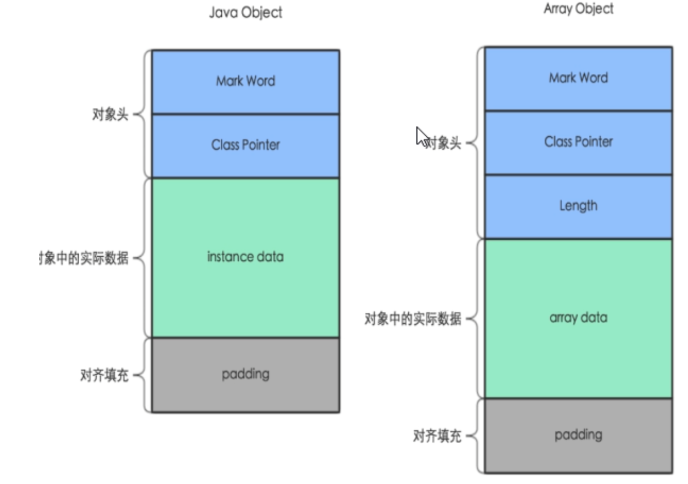
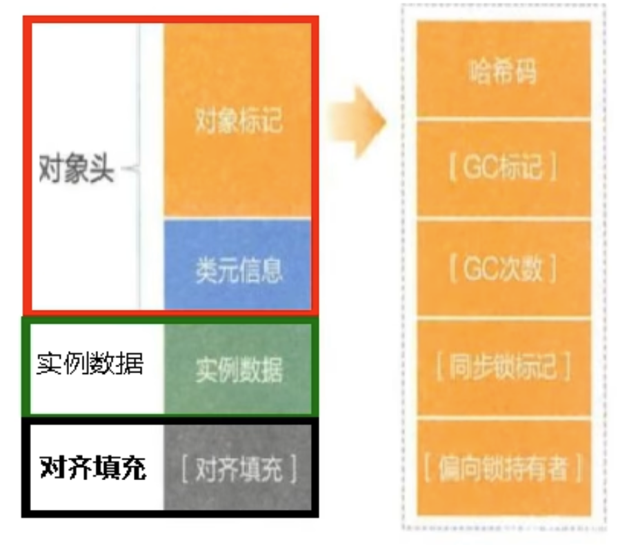
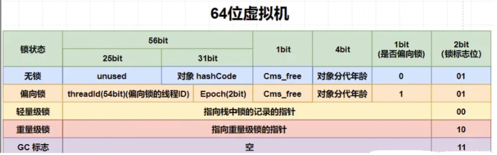

# Java對象內存佈局和對象頭

## `Object obj = new Object()`這句話的理解

* 位置所在:point_right: JVM堆 -> 新生代 -> 伊甸園區
* 構成佈局:point_right: 對象頭 + 實例數據 + 對齊填充



### 對象在堆內存的存儲佈局

* 對象頭 👉 **在64位系統中，Mark Word佔了8個字節，類型指針佔了8個字節，一共是16個字節**
  1. 對象標記(Mark Word)
     
     * 默認存儲對象的HashCode、分代年齡和鎖標誌位等信息。
     * 這些信息都是與自身對象定義無關的數據，所以Mark Word被設計成一個非固定的數據結構以便在極小的空間內存儲盡量多的數據。
     * 他會根據對象的狀態複用自己的存儲空間，也就是說在運行期間Mark Word裡面存儲的數據會隨著鎖標誌位的變化而改變。
  2. 類元信息(類型指針)：對象指向他的類元數據的指針，**虛擬機通過這個指針來確定這個對象屬於哪個類的實例**。
* 實例數據：存放類的屬性(Field)數據信息，包括父類的屬性信息。
* 對齊填充(保證8個字節的倍數)：虛擬機要求對象起始地址必須是8字節的整數倍，填充數據不是必須存在的，僅僅是為了字節對齊這部分內存按8字節補充對齊。

```java
class Customer {
    int id;
    boolean flag = false;
}
```

對象頭16字節(忽略壓縮指針的影響) + 實例數據5字節(4字節(int) + 1字節(boolean)) = 21字節 ---> 對齊填充，共24字節

## 對象頭Mark Word


