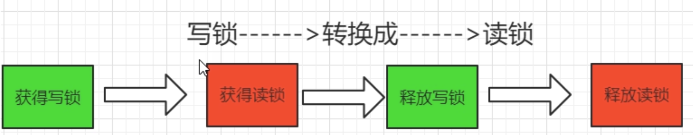
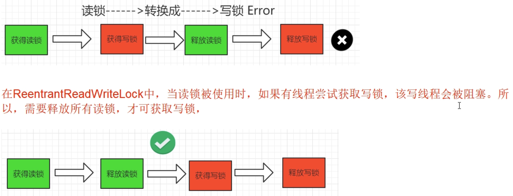

# `ReentrantLock`、`ReentrantReadWriteLock`、`StampedLock`

## `ReentrantReadWriteLock`

### 是什麼？

* 讀寫鎖：一個資源能被**多個線程**訪問，或者被**一個寫線程**訪問，但是不能同時存在讀寫線程。
* 演變：無鎖無序 -> 加鎖 -> 讀寫鎖 -> 郵戳鎖
* 讀寫鎖意義和特點
  * 他**只允許讀讀共存，而讀寫和寫寫依然是互斥的**，大多實際場景**是"讀/讀"線程間並不存在互斥關係**。只有"讀/寫"線程或"寫/寫"線程間的操作需要互斥的。因此引入`ReentrantReadWriteLock`。
  * 一個`ReentrantReadWriteLock`同時只能存在一個寫鎖但是可以存在多個讀鎖，但**不能同時存在寫鎖和讀鎖**。也即**一個資源可以被多個讀操作訪問或一個寫操作訪問，但兩者不能同時進行**。
  * 只有在**讀多寫少**情景下，讀寫鎖才具有較高的性能體現。

### 特點

* 讀寫兼顧
* 可重入(重進入)：該鎖支持重入，以讀寫線程為例：讀線程在獲取了讀鎖之後，能夠再次獲取讀鎖。而**寫線程在獲取寫鎖之後能夠再次獲取寫鎖，同時也可以獲取讀鎖**。
* 💡結論：**一體兩面，讀寫互斥，讀讀共享，讀沒有完成的時候其他線程寫鎖無法獲得**
* 💡**鎖降級**： 👉為了保證數據一致性
  * 將**寫鎖降級為讀鎖**--->遵循獲取寫鎖、獲取讀鎖再釋放寫鎖的次序，寫鎖可以降級成讀鎖。
  * 如果**同一個線程持有寫鎖，在沒有釋放寫鎖的情況下，他還可以繼續獲得讀鎖。這就是寫鎖的降級，降級成了讀鎖**。
  * 規則慣例：先獲取寫鎖，然後獲取讀鎖，再釋放寫鎖  的次序。
  * 如果釋放了寫鎖，那麼就完全轉換為讀鎖。
  * 重入還允許通過獲取寫入鎖定，然後讀取鎖然後釋放寫鎖從寫鎖到讀取鎖。但是，**從讀鎖升級到寫鎖是不可能的**。

#### 寫鎖和讀鎖是互斥的

寫鎖和讀鎖是互斥的(這裡的互斥**是指線程間的互斥**，當前線程可以獲取到寫鎖又獲取到讀鎖，但是獲取到了讀鎖不能繼續獲取寫鎖)，這是因為讀寫鎖要**保持寫操作的可見性**。因為，如果允許讀鎖在被獲取的情況下對寫鎖的獲取，那麼正在運行的其他讀線程無法感知到當前寫線程的操作。

*讀鎖結束，寫鎖有望; 寫鎖獨佔，讀寫全堵*：如果有線程正在讀，寫線程需要等待讀線程釋放鎖後才能獲取寫鎖。

即`ReentrantReadWriteLock`讀的過程中不允許寫，只有等待線程都釋放了鎖，當前線程才能獲取**寫鎖**，也**就是寫入必須等待，是一種悲觀的讀鎖**。

## 郵戳鎖`StampedLock`

### 是什麼？

`StampedLock`是JDK1.8新增的一個讀寫鎖，也是對JDK1.5中的讀寫鎖`ReentrantReadWriteLock`的優化。

stamp(戳記，`long`類型)：代表鎖的狀態。當stamp返回0時，表示線程獲取鎖失敗。並且當釋放鎖或者轉換鎖時，都要傳入最初獲取的stamp值。

### 他是由飢餓問題引出

`ReentrantReadWriteLock實現了讀寫分離，但是**一但讀操作比較多的時候，想要獲取寫鎖就比較困難了**，假如當前1000個線程，999個讀，1個寫，有可能999個讀取線程長時間搶到了鎖，那1個寫線程就會遲遲獲取不到鎖。(**因為當前有可能會一直存在讀鎖，而無法獲得寫鎖**)

#### 如何緩解飢餓問題

* 使用"公平策略"可以一定程度上緩解這個問題 -> `new ReentrantReadWriteLock(true)`
* 但是"公平策略"是以犧牲系統吞吐量為代價的
* `StampedLock`類的樂觀讀鎖：`StampedLock`採取樂觀獲取鎖後，其他線程嘗試獲取寫鎖時**不會被阻塞**，這其實是對讀鎖的優化。所以，**在獲取樂觀讀鎖後，還需要對結果進行校驗**。-> 👉對短的只讀代碼段，使用樂觀模式通常可以減少徵用並提高吞吐量。

### `StampedLock`特點

* 所有**獲取鎖**的方法，都返回一個郵戳(Stamp)，Stamp為0表示獲取失敗，其餘都表示成功。
* 所有**釋放鎖**的方法，都需要一個郵戳(Stamp)，這個Stamp必須適合成功獲取鎖識得到的Stamp一致。
* `StampedLock`是**不可重入**的，危險(如果一個線程已經持有了寫鎖，再去獲取寫鎖的話就會造成死鎖)
* `StampedLock`有3種訪問模式

  * Reading(讀模式悲觀)：功能和`ReentrantReadWriteLock`的讀鎖類似。
  * Writing(寫模式)：功能和`ReentrantReadWriteLock`的寫鎖類似。
  * **Optimistic Reading(樂觀讀模式)**：無鎖機制，類似於數據庫中的樂觀鎖，支持讀寫并發，**很樂觀認為讀取時沒人修改，假如被修改再實現升級為悲觀讀模式**。

💡**讀的過程中也允許寫鎖介入**

### `StampedLock`缺點

* `StampedLock`不支持重入，沒有Re開頭。
* `StampedLock`的悲觀讀鎖和寫鎖都不支持條件變量(Condition)，這個也需要注意。
* 使用`StampedLock`一定不要調用中斷操作，即不要調用`interrupt()`方法。
