# Synchronized與鎖升級


## Synchronized的性能變化

* Java5以前，只有synchronized，這是操作系統級別的重量級操作

  * 重量級鎖，假如競爭激烈的話，性能急遽下降
  * **會牽涉用戶態和內核態的切換(容易導致阻塞)**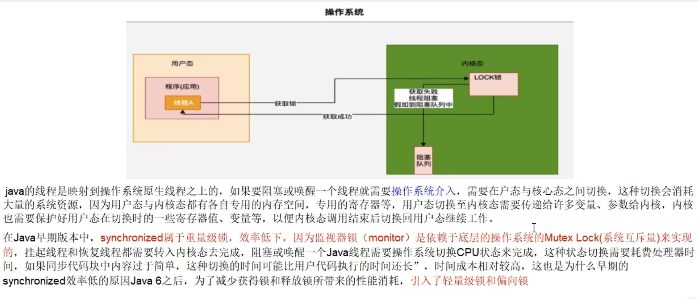
* Java6開始為了減少獲得鎖和釋放鎖帶來的性能消耗，引入了**輕量鎖和偏向鎖**，需要有個逐步升級的過程，別一開始到重量級鎖。

## Synchronized鎖種類和升級流程

### 升級流程

* synchronized用的鎖是存在Java對象頭裡的Mark Word中，鎖升級功能主要依賴Mark Word中鎖標誌位和釋放偏向鎖標誌位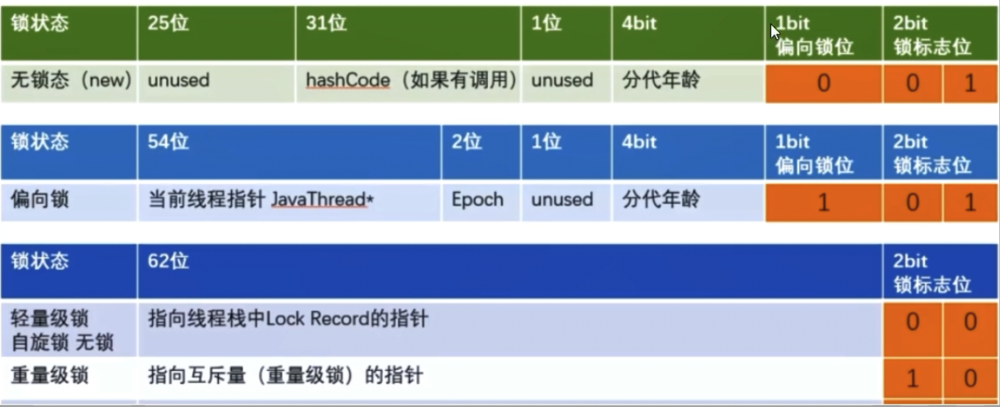
* 鎖指向
  * **偏向鎖：Mark Word存儲的是偏向的線程ID**
  * **輕量鎖：Mark Word存儲的是指向線程棧中的Lock Record的指針**
  * **重量鎖：Mark Word存儲的是指向堆中的Monitor對象的指針**

### 無鎖

初始狀態，一個對象被實例化後，如果還沒有被任何線程競爭鎖，那他就為無鎖狀態(**001**)

HashCode是由每組字節由右下往左上看的

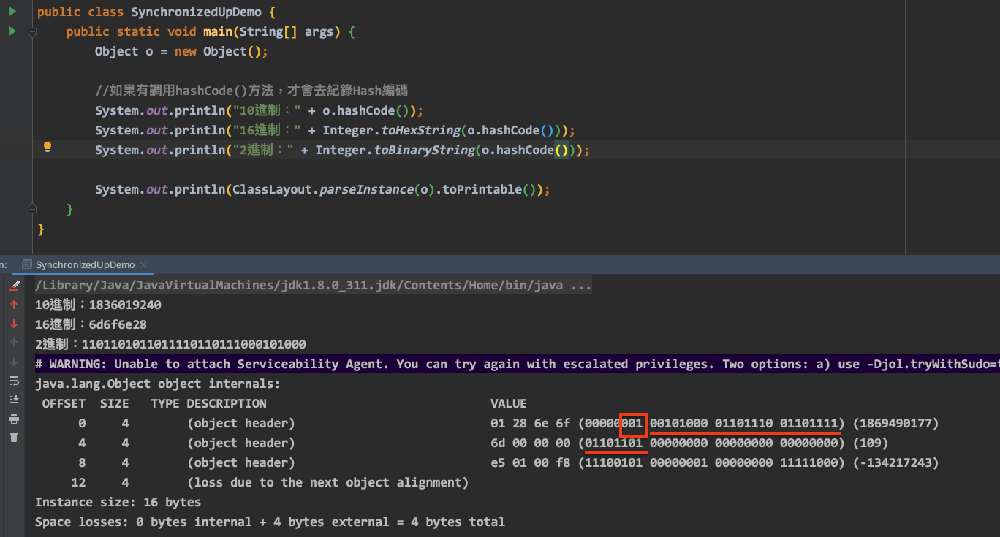

### 偏向鎖

**單線程競爭**，當線程A第一次競爭到鎖時，通過修改Mark Word中的偏向線程ID、偏向模式。如果不存在其他線程競爭，那麼持有偏向鎖的線程將永遠不需要進行同步。

**當同一段同步代碼一直被同一個線程多次訪問，由於只有一個線程那麼該線程在後續訪問時便會自動獲得鎖。**(避免多次用戶態和內核態的切換)

#### 結論

* HotSpot的作者經過研究發現，多線程大多情況下，鎖不僅不存在多線程競爭，還存在鎖**由同一個線程多次獲得的情況**。偏向鎖就是在這種情況下出現的，他的出現是為解決**只有在一個線程執行同步時提高性能**。
* 偏向鎖會會偏向於第一個訪問鎖的線程，如果在接下來的運行過程中，該鎖沒有被其他線程訪問，則持有偏向鎖的線程將永遠不需要觸發同步。也即偏向鎖在資源沒有競爭情況下消除了同步語句，連CAS都不做了，提高程序性能。

#### 理論

在實際應用運行過程中發現，"鎖總是同一個線程持有，很少發生競爭"，也就是說**鎖總是被第一個佔用他的線程持有，這個線程就是鎖的偏向線程**。那麼只需要在鎖第一次被擁有的時候，記錄下偏向線程ID。這樣偏向線程就一直持有著鎖(後續這個線程進入和退出這段加了同步鎖的代碼塊時，**不需要再次加鎖和釋放鎖**。而是直接去檢查鎖的Mark Word裡面是不是放得自己的線程ID)。如果相等表示偏向鎖事偏向於當前線程的，就不需要嘗試獲得鎖了，直到競爭發生才釋放鎖。以後每次同步，檢查鎖的偏向線程ID與當前線程ID是否一致，如果一致直接進入同步。無需每次加鎖都去CAS更新對象頭。**如果自始至終鎖的線程只有一個，很明顯偏向鎖幾乎沒有額外開銷，性能極高**。如果不等，表示發生了競爭，鎖已經不是總是偏向於同一個線程了，這個時候會嘗試使用CAS來替換Mark Word裡面的線程ID為新的線程ID。

* **競爭成功**，表示之前的線程不存在了，Mark Word裡面的線程ID為新線程的ID，鎖不會升級，仍然為偏向鎖。
* **競爭失敗**，這時候可能需要升級變為輕量級鎖，才能保證線程間公平競爭鎖。

💡**偏向鎖只有遇到其他線程嘗試競爭偏向鎖時，持有偏向鎖的線程才會釋放鎖，線程是不會主動釋放偏向鎖的**。

#### 技術實現

一個synchronized方法被一個線程搶到了鎖時，那這個方法所在的對象就會在其所在的Mark Word中將偏向鎖修改狀態位，同時還會有佔用前54位來存儲線程指針作為標示。若該線程再次訪問同一個synchronized方法時，該線程只需去對象頭的Mark Word中去判斷一下是否有偏向鎖指向本身的ID，無需再進入Monitor去競爭對象了。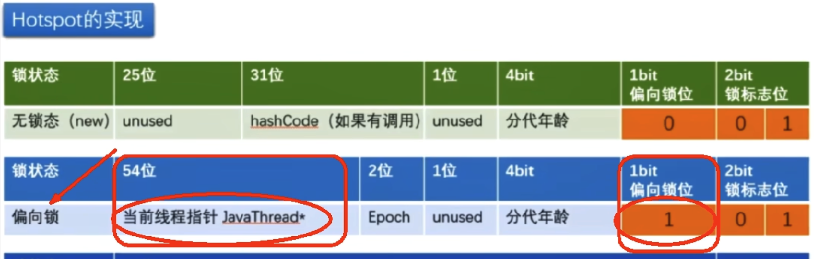


#### 開啟偏向鎖

* 查看偏向鎖相關內容(Java15之後沒有偏向鎖了)
  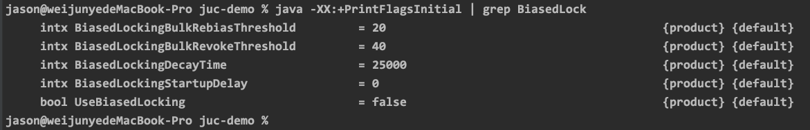

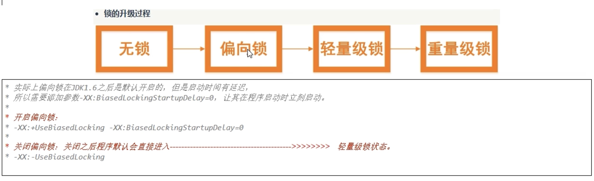


#### 偏向鎖的撤銷

* 當有另一個線程逐步來競爭鎖時，就不能再使用偏向鎖了，要升級為輕量級鎖，使用的是等到競爭出現才釋放鎖的的機制。
* 競爭線程嘗試CAS更新對象頭失敗，會等待到全局安全點(此時不會執行任何代碼)撤銷偏向鎖。
  * 第一個線程正在執行synchronized方法(處於同步塊)，他還沒有執行完，其他線程來搶奪，該偏向鎖會被取消掉並出現**鎖升級**。此時輕量鎖由原先持有偏向鎖的線程持有，繼續執行其同步代碼，而正在競爭的線程會進入自旋等待獲得該輕量級鎖。
  * 第一個線程執行完成synchronized方法(退出同步塊)，則將對象頭設置成無鎖狀態並撤銷偏向鎖，重新偏向。
  * 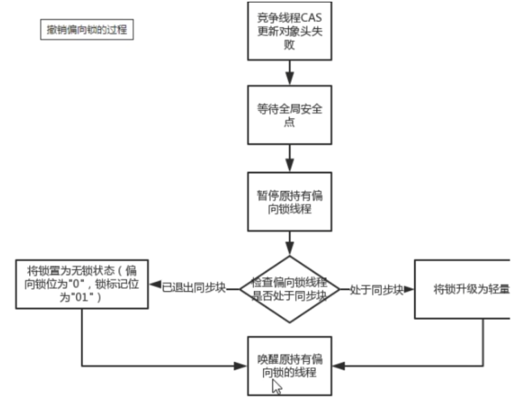

💡 Java15以後逐步廢棄偏向鎖，需要手動開啟 -> 開銷成本大


### 輕量級鎖

**多線程競爭，但任意時候最多只有一個最多只有一個線程競爭**，即不存在鎖競爭太過激烈的情況，也就沒有線程阻塞。

#### 主要作用

有線程來參與鎖的競爭，但是獲取鎖的衝突時間極短，**本質就是自旋鎖CAS**

#### 輕量鎖的獲取

輕量級鎖是為了在線程近乎交替執行同步塊時提高性能。

主要目的：在沒有多線程競爭的前提下，通過**CAS**減少重量級鎖使用操作系統互斥量產生的性能消耗，說白了**先自旋，不行才升級阻塞**。

升級時機：當關閉偏向鎖功能或多線程競爭偏向鎖會導致偏向鎖升級為輕量級鎖。

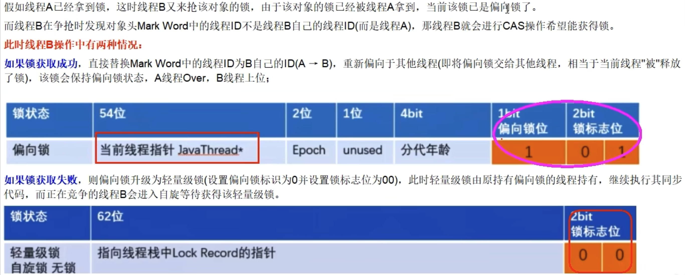

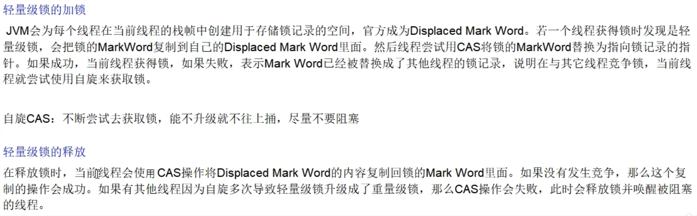

#### 案例

```java=
//關閉偏向鎖    -XX:-UseBiasedLocking  就會直接使用輕量級鎖
Object o = new Object();
    new Thread(() -> {
        synchronized (o) {
            System.out.println(ClassLayout.parseInstance(o).toPrintable());
        }
}, "t1").start();
```

自旋達到一定次數和程度(Java6之後是**自旋自適應鎖**)

* 線程如果自旋成功了，那下次自旋的最大次數會**增加**，因為JVM認為既然上次成功了，那麼這次也大機率會成功。
* 如果很少自旋成功，那麼下次會**減少**自旋的次數甚至不自旋，避免CPU空轉。

輕量鎖和偏向鎖的區別：

* 爭奪輕量鎖失敗時，會自旋嘗試搶佔鎖。
* 輕量鎖每次退出同步塊都需要釋放鎖，而偏向鎖是在競爭發生時才釋放鎖。


### 重量級鎖

有大量的線程參與鎖的競爭，衝突性很高。

#### 原理


Java中的synchronized重量級鎖，是基於進入和退出Monitor對象實現的，在編譯時會將同步塊的開始位置插入monitor enter指令，在結束位置插入monitor exit指令。

當線程執行到monitor enter指令時，會嘗試獲取對象對應的Monitor所有權，如果獲取到了，即獲取到了鎖，會在Monitor的owner中存放當前線程的ID，這樣他將處於鎖定狀態，除非退出同步塊，否則其他線程無法獲取到這個Monitor。


### 總結

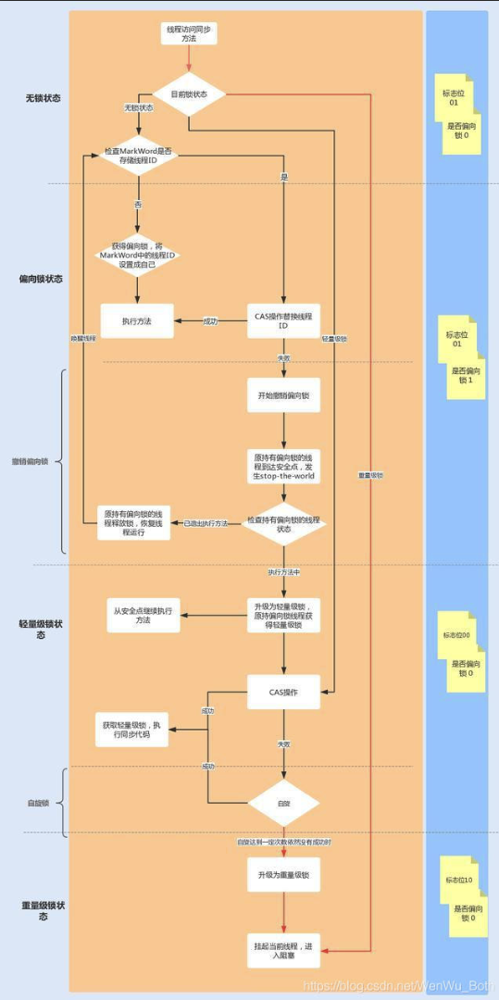

#### 鎖升級後，哈希碼去哪了

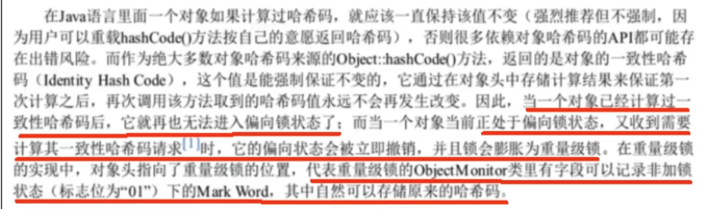

* **無鎖**狀態下，Mark Word中可以存儲對象的identity hash code值。當對象的`hashCode()`方法第一次被調用時，JVM會生成對應的identity hash code值並將該值存儲到Mark Word中。
* 對於**偏向鎖**，在線程獲取偏向鎖時，會用Thread ID和epoch值(理解為時間戳)覆蓋identity hash code所在的位置。**如果一個對象的`hashCode()`方法已經被調用過一次，這個對象不能被設置偏向鎖**。因為如果可以的話，那Mark Word中的identity hash code必然會被偏向線程id覆蓋，就會造成同一個對象前後兩次調用`hashCode()`方法得到的結果不一樣。
* 升級為**輕量鎖**時，JVM會在當前線程的棧中創建一個鎖紀錄(Lock Record)空間，用於存儲鎖對象的Mark Word拷貝，該拷貝中可以包含identity hash code，所以**輕量級鎖可以和identity hash code共存**，哈希碼和GC年齡自然保存在此，釋放鎖後會將這些信息寫回到對象頭。
* 升級為**重量鎖**時，Mark Word保存的重量級鎖指針，代表重量級鎖的ObjectMonitor類中有字段紀錄非加鎖狀態下的Mark Word，鎖釋放後也會將信息寫回到對象頭。
