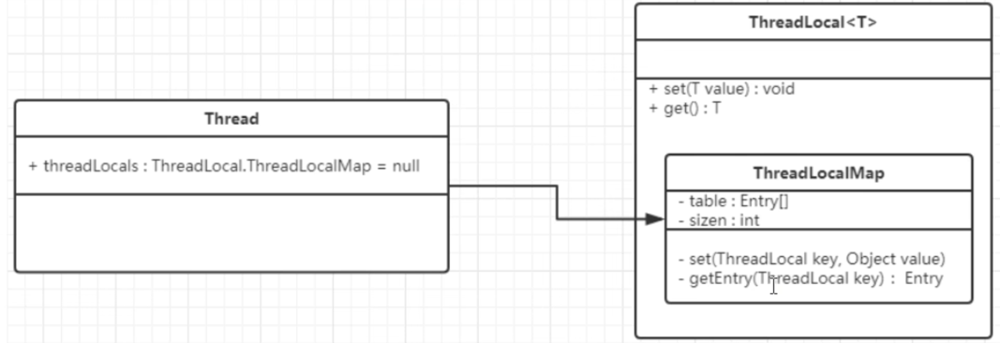
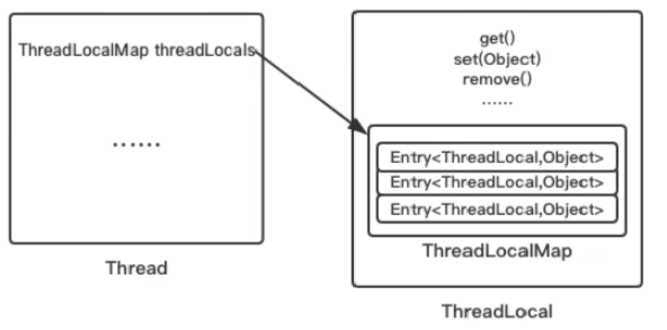
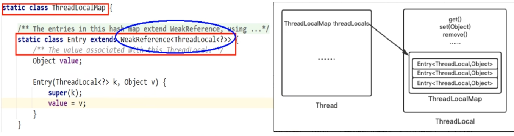
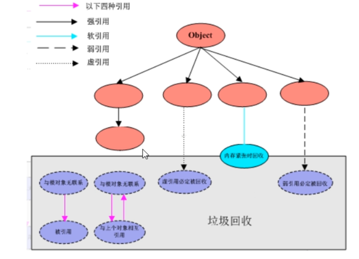

# ThreadLocal

## 是什麼

ThreadLocal提供線程局部變量。這些變量與正常的變量不同，因為每一個線程在訪問ThreadLocal實例時(通過其get或set方法)都有自己的、獨立的初始化的變量副本。
ThreadLocal實例通常是類中的私有靜態字段，使用他的目的是希望將狀態(ex. 用戶ID或事務ID)與線程關聯起來。

## 能幹嘛

實現**每一個線程都有自己專屬的本地變量副本**。` `
主要解決了讓每個線程綁定自己的值，通過使用 `get()`和 `set()`方法，獲取默認值或將其值更改為當前線程所存的副本的值，**從而避免了線程安全問題**。

## 小總結

因為每個Thread內有自己的**實例副本**且該副本只由當前線程自己使用。` `
既然其他Thread不可訪問，那就不存在多線程間共享的問題。` `
統一設置初始值，但是每個線程對這個值的修改都是各自線程互相獨立的。` `

如何才能不爭搶？

1. 加入 `synchronized`或者 `Lock`控制資源的訪問順序
2. 使用 `ThreadLocal`人手一份

## `Thread`、`ThreadLocal`、`ThreadLocalMap`

* `ThreadLocalMap`實際上就是一個以 `ThreadLocal`為key，任意對象為value的Entry對象。
* 當我們為 `ThreadLocal`變量賦值，實際上就是以當前 `ThreadLocal`實例為key，值為value的Entry往這個 `ThreadLocalMap`中存放。

JVM內部維護了一個線程版的 `Map<ThreadLocal, Value>`(通過 `ThreadLocal`對象的 `set()`方法，把 `ThreadLocal`對象自己當作key，放進 `ThreadLocalMap`中)，
每個線程要用到這個 `T`的時候，用**當前的線程**去 `Map`中獲取，**通過這樣讓每個線程都擁有自己獨立的變量**。

## 內存泄露

不再被使用的對象或是變量佔用的內存不能被回收，就是內存泄露

### 為什麼會內存泄露

`ThreadLocalMap`從字面上就可以看出這是一個保存 `ThreadLocal`對象的map(以 `ThreadLocal`為key)，不過是經過了兩層包裝的 `ThreadLocal`對象

1. 第一層包裝是使用 `WeakReference<ThreadLocal<?>>`將 `ThreadLocal`對象變成一個**弱引用對象**。
2. 第二層包裝是定義了一個專門的Entry類來擴展 `WeakReference<ThreadLocal<?>>`。

### 強軟弱虛 引用

#### 強引用

當內存不足，JVM開始垃圾回收，對於強引用的對象，**就算是出現了OOM也不會對該對象進行回收**。` `

強引用是我們最常見的普通對象引用，只要還有強引用指向一個對象，就表明對象還"活著"，垃圾回收器不會碰這種對象。` `
在Java中最常見的就是強引用，把一個對象賦給一個引用變量，這個引用變量就是一個強引用。` `
當一個對象被強引用變量引用時，他處於可達狀態，他是不可能被垃圾回收機制回收的，**即使該對象以後永遠都不會用到JVM也不會回收。因此強引用是造成Java內存泄露的主要原因**。` `
對於一個普通對象，如果沒有其他引用關係，只要超過了引用的作用域或者顯式的將相應的引用賦值為 `null`，一般認為就是可以被垃圾回收收集了(當然具體還是要看垃圾收集策略)。

#### 軟引用

軟引用是一種相對強引用弱化了一些的引用，需要使用 `java.lang.ref.SoftReference`類來實現，可以讓對象豁免一些垃圾收集。` `
對於只有軟引用的對象來說：

* **當系統內存充足時他不會被回收**
* **當系統內存不足時他才會被回收**

軟引用通常用在對內存敏感的程序中，比如高速緩存就有用到軟引用，**內存夠用的時候就保留，不夠用就回收！**

假如有一個應用需要讀取大量的本地圖片

* 如果每次讀取圖片都從硬盤讀取會嚴重影響性能
* 如果一次性全部加載到內存又可能造成內存溢出

此時使用**軟引用**可以解決這個問題，設計思路是：用一個`HashMap`來保存圖片路徑和相應圖片對象關聯的軟引用之間的映射關係，當內存不足時，JVM會自動回收這些緩存圖片對象所佔用的空間，從而有效避免了OOM的問題:point_right:`Map<String, SoftReference<Bitmap>> imageCache = new HashMap<String, SoftReference<Bitmap>>()`

#### 弱引用

若引用需要用`java.lang.ref.WeakReference`類來實現，他比軟引用的生存期更短
**對於只有若引用的對象來說，只要垃圾回收機制一運行，不管JVM的內存空間是否足夠，都會回收該對象佔用的內存**

#### 虛引用

1. 虛引用必須和引用對列`ReferenceQueue`聯合使用：虛引用需要`java.lang.PhantomReference`類來實現，顧名思義就是**形同虛設**，與其他幾種引用都不同，虛引用並不會決定對象的生命週期。如果一個對象僅持有虛引用，那麼他就和沒有任何引用一樣，在任何時候都可能被垃圾回收器回收，他不能單獨使用也不能通過他訪問對象，虛引用必須和引用對列`ReferenceQueue`聯合使用:point_right:這個虛引用被幹掉了，他將會裝到引用對列裡面，這個對列有對象了，代表後台發生一次虛引用的對象回收。
2. `PhantomReference`的`get()`方法總是返回`null`：虛引用的主要作用是跟蹤對象被垃圾回收的狀態。僅僅提供了一種確保對象被finalize以後，最某些事情的通知機制。`PhantomReference`的`get()`方法總是返回`null`，因此無法訪問對應的引用對象。
3. 處理監控通知使用：換句話說，設置虛引用關聯對象的唯一目的，就是在這個對象被收集器回收的時候收到一個系統通知或者後續添加進一步的處理，用來實現比finalize機制更靈活的回收操作。

#### GCRoots和四大引用小總結

